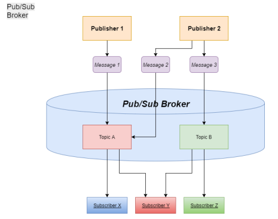

[](https://www.python.org/downloads/release/python-37/)
[](https://www.python.org/downloads/release/python-38/)
# Publish-Subscribe System
A simple version of a Publish-Subscribe (Pub/Sub) system, similar to Apache Kafka. Pub/Sub messaging, is a form of asynchronous service-to-service communication used in serverless and microservices architectures. In a pub/sub model, any message published to a topic is immediately received by all of the subscribers to the topic. Pub/sub messaging can be used to enable event-driven architectures, or to decouple applications in order to increase performance, reliability and scalability<br>

## Requirments

Developed in ```Python 3.7.11``` on ```Windows 10```<br>
Tested in ```Python 3.8.10``` on ```Ubuntu 20.04```

## Usage

### Broker
```bash
$ python3 broker -s s_port -p p_port

Example:
  $ python3 broker.py -s 9090 -p 9000
  
positional arguments:
    -s               Indicates the port of this specific broker where subscribers will connect.
    -p               Indicates the port of this specific broker where publishers will connect.
```

### Publisher
```bash
$ python3 publisher -i ID -r sub_port -h broker_IP -p port [-f command_file]

Example:
  $ python3 publisher -i p1 -r 8200 -h 127.0.0.1 -p 9000 -f publisher1.cmd

positional arguments:

    -i               Indicates the id of this publisher.
    -r               Indicates the port of this specific publisher.
    -h               Indicates the IP address of the broker
    -p               Indicates the port of the broker.

optional arguments:
    -f               Indicates a file name where there are commands that the publisher will execute once started and connected to the broker
```

### Subscriber
```bash
$ python3 subscriber -i ID -r sub_port -h broker_IP -p port [-f command_file]

Example:
  $ python3 subscriber -i s1 -r 8000 -h 127.0.0.1 -p 9000 -f subscriber1.cmd

positional arguments:

    -i               Indicates the id of this subscriber.
    -r               Indicates the port of this specific subscriber.
    -h               Indicates the IP address of the broker
    -p               Indicates the port of the broker.

optional arguments:
    -f               Indicates a file name where there are commands that the subscriber will execute once started and connected to the broker
```
## Project Organization

    ├── README.md           <- The top-level README for developers.
    │
    ├── Report.pdf          <- A short report about the project architecture
    │
    ├── utils.py            <- Helper functions
    │
    ├── broker.py           <- The Broker connects the Publishers and the Subscribers together
    │
    ├── subscriber.py       <- When started, will connect to the Broker and subscribe to one or more topics
    │
    ├── publisher.py        <- Connects to the Broker in a similar way to the Subscriber, producing messages for specific topics
    │
    ├── logger.py           <- Confgigure logging method
    │
    └── config.ini          <- Initialize host and bytes size

